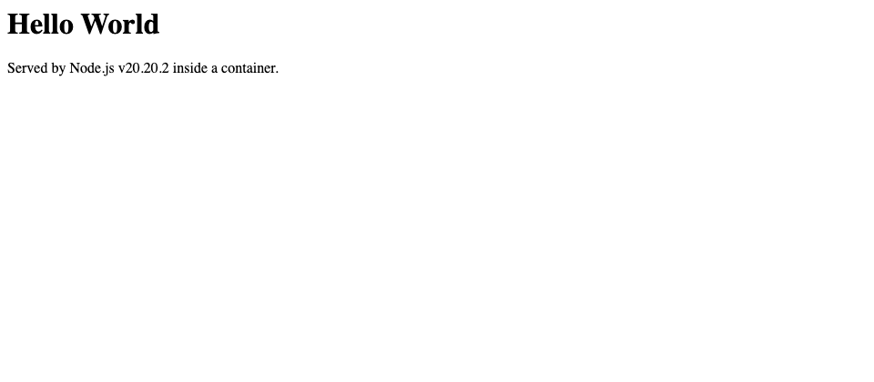
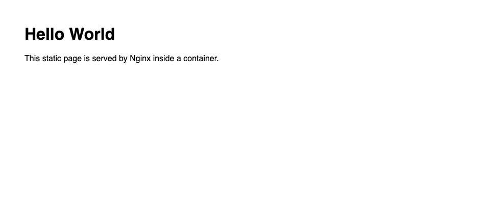

# Docker Fundamentals — Six Hello World Containers

Demonstration of serving identical "Hello World" application endpoints across six distinct software stacks, each provisioned using standalone Dockerfile build context configurations. All six container instances were compiled and launched concurrently.

## Directory Structure Overview

```
Docker Fundamentals/
├── nodejs-app/    Node.js 20 runtime, built-in http module (zero external dependencies)
├── python-app/    Python 3.12 runtime with Flask web framework
├── java-app/      Java 21 JDK, built-in com.sun.net.httpserver compiled during image build
├── Apache-app/    Apache HTTP Server (httpd 2.4) serving static HTML page
├── React-app/     React 18 + Vite frontend, multi-stage build, served via Nginx Alpine
└── nginx-app/     Nginx Alpine web server serving static HTML page
```

## Port Allocations

Each application binds to its native container port internally. Host port bindings were selected to prevent system port collisions.

| Application Stack | Image Tag | Internal Port | Host Port | Local Access Endpoint |
|---|---|---|---|---|
| Node.js | `nodejs-app` | 3000 | 3002 | http://localhost:3002 |
| Python / Flask | `python-app` | 5000 | 5001 | http://localhost:5001 |
| Java | `java-app` | 8080 | 8080 | http://localhost:8080 |
| Apache | `apache-app` | 80 | 8081 | http://localhost:8081 |
| React | `react-app` | 80 | 8082 | http://localhost:8082 |
| Nginx | `nginx-app` | 80 | 8083 | http://localhost:8083 |

## Unified Build & Deployment Workflow

Execute from within `Docker Fundamentals/`:

```bash
# Build container images
docker build -t nodejs-app ./nodejs-app
docker build -t python-app ./python-app
docker build -t java-app   ./java-app
docker build -t apache-app ./Apache-app
docker build -t react-app  ./React-app
docker build -t nginx-app  ./nginx-app

# Launch detached container instances
docker run -d --name hello-node   -p 3002:3000 nodejs-app
docker run -d --name hello-python -p 5001:5000 python-app
docker run -d --name hello-java   -p 8080:8080 java-app
docker run -d --name hello-apache -p 8081:80   apache-app
docker run -d --name hello-react  -p 8082:80   react-app
docker run -d --name hello-nginx  -p 8083:80   nginx-app

# Verify running processes
docker ps --filter name=hello-
```

Teardown command:

```bash
docker rm -f hello-node hello-python hello-java hello-apache hello-react hello-nginx
```

## Dockerfile Architecture Breakdown

- **`nodejs-app`**: Base image `node:20-alpine`. Copies `package.json` and `app.js`. Standard `http` module eliminates external dependency overhead. `.dockerignore` excludes local `node_modules`.
- **`python-app`**: Base image `python:3.12-slim`. Copies and installs dependencies prior to copying application source code to optimize Docker layer caching. Flask binds to `0.0.0.0`.
- **`java-app`**: Base image `eclipse-temurin:21-jdk`. Compiles `Main.java` at image build time using JDK built-in `com.sun.net.httpserver`.
- **`Apache-app`**: Base image `httpd:2.4`. Single layer copy into `/usr/local/apache2/htdocs/`.
- **`React-app`**: Multi-stage build process. Stage 1 (`node:20-alpine`) compiles production static assets with `vite build`. Stage 2 (`nginx:alpine`) serves generated `dist/` directory, omitting Node runtime overhead from the final image.
- **`nginx-app`**: Base image `nginx:alpine`. Direct copy into `/usr/share/nginx/html/`.

## Container Image Footprint Analysis

| Container Image | Footprint Size |
|---|---|
| nginx-app | 102 MB |
| react-app | 102 MB |
| nodejs-app | 194 MB |
| apache-app | 205 MB |
| python-app | 234 MB |
| java-app | 744 MB |

*Analysis*: The Java image footprint is larger due to carrying full JDK binaries. Utilizing a JRE runtime or `jlink` custom image generation drastically reduces image size.

## Endpoint Verification

Execution of `curl` against HTTP endpoints returns `<h1>Hello World</h1>` payloads. The React application returns an HTML shell containing JavaScript imports rendered dynamically in client browser sessions.

## Execution Screenshots

Build output, execution status (`docker ps`), endpoint verification via `curl`, and final image footprint metrics:


Browser execution view for each application stack:

| | |
|---|---|
| Node.js  | Python  |
| Java  | Apache  |
| React  | Nginx  |
