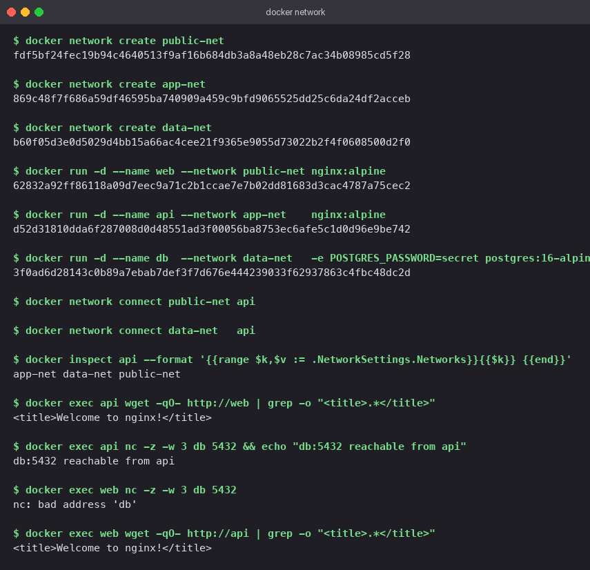
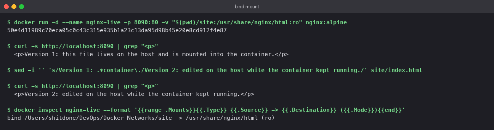

# Docker Networks and Volumes

Hands-on lab experiments covering container networking drivers and storage volume management: custom user-defined bridge isolation, host networking mode, bind mounts, and distributed overlay network architecture.

---

## 1. Three-Tier Isolation: Containers & Bridge Networks

*Goal*: Configure a 3-tier architecture (`web`, `api`, `db`) where the middle-tier (`api`) communicates with both front-end and back-end tiers, while preventing direct network reachability between `web` and `db`.

### Topology Mapping

| Container Instance | Image Base | Attached Networks |
|---|---|---|
| `web` | `nginx:alpine` | `public-net` |
| `api` | `nginx:alpine` | `app-net`, `public-net`, `data-net` |
| `db` | `postgres:16-alpine` | `data-net` |

### Configuration Commands

```bash
# Provision isolated bridge networks
docker network create public-net
docker network create app-net
docker network create data-net

# Instantiate containers on primary networks
docker run -d --name web --network public-net nginx:alpine
docker run -d --name api --network app-net    nginx:alpine
docker run -d --name db  --network data-net   -e POSTGRES_PASSWORD=secret postgres:16-alpine

# Attach API container to remaining network bridges
docker network connect public-net api
docker network connect data-net   api

# Verify interface attachments
docker inspect api --format '{{range $k,$v := .NetworkSettings.Networks}}{{$k}} {{end}}'
# Output: app-net data-net public-net
```

### Connectivity Verification

```bash
docker exec api wget -qO- http://web | grep -o "<title>.*</title>"     # Success (HTTP 200)
docker exec api nc -z -w 3 db 5432 && echo "db:5432 reachable from api"      # Success (Port 5432 Open)
docker exec web nc -z -w 3 db 5432                                      # Fails (nc: bad address 'db')
docker exec web wget -qO- http://api | grep -o "<title>.*</title>"     # Success (HTTP 200)
```

### Architectural Analysis

- User-defined bridge networks enable Docker's embedded DNS engine for container name resolution. `web` resolves `api` due to shared membership on `public-net`.
- `web` cannot resolve `db` hostname because they share no common network. This provides strict layer-3 network isolation.
- Multi-homed containers (`api`) retain distinct virtual ethernet interfaces and IP addresses per attached bridge network.



---

## 2. Host Networking Driver (`--network host`)

In host networking mode, a container shares the host's network namespace directly, bypassing Docker's virtual bridge and NAT port forwarding.

Custom configuration (`host-net/default.conf` listening on port 8085):

```nginx
server {
    listen 8085;
    location / {
        root  /usr/share/nginx/html;
        index index.html;
    }
}
```

```bash
docker run -d --name host-web --network host \
  -v "$(pwd)/host-net/default.conf:/etc/nginx/conf.d/default.conf:ro" nginx:alpine
docker ps --filter name=host-web        # PORTS column is empty
docker inspect host-web --format '{{.HostConfig.NetworkMode}}'   # host
```

When running `--network host`, port mapping flags (`-p`) are disabled because Nginx binds directly to host network interface port 8085.

*Verification*: On Docker Desktop (where Docker runs inside a virtual machine), host network connectivity was verified by executing an auxiliary ephemeral container sharing the host network namespace:

```bash
docker run --rm --network host alpine wget -qO- http://127.0.0.1:8085 | grep -o "<title>.*</title>"
# Output: <title>Welcome to nginx!</title>
```

On native Linux hosts, the endpoint is directly accessible via `http://localhost:8085`.


---

## 3. Host Directory Bind Mounts (`-v`)

Bind mounts map host directory paths directly into container file systems. Modifications made on either host or container take effect immediately without requiring image rebuilds or container restarts.

```bash
mkdir site
# Provision site/index.html

docker run -d --name nginx-live -p 8090:80 \
  -v "$(pwd)/site:/usr/share/nginx/html:ro" nginx:alpine

curl -s http://localhost:8090 | grep "<p>"
# Output: <p>Version 1: this file lives on the host and is mounted into the container.</p>

# Update file directly on host file system while container runs
sed -i '' 's/Version 1: .*container\./Version 2: edited on the host while the container kept running./' site/index.html

curl -s http://localhost:8090 | grep "<p>"
# Output: <p>Version 2: edited on the host while the container kept running.</p>

docker inspect nginx-live --format '{{range .Mounts}}{{.Type}} {{.Source}} -> {{.Destination}} ({{.Mode}}){{end}}'
# Output: bind /.../Docker Networks/site -> /usr/share/nginx/html (ro)
```

The `:ro` flag mounts target directories in read-only mode inside containers, securing underlying host storage.



---

## 4. Overlay Networks (Multi-Host Networking)

While bridge networks operate strictly within a single Docker host, **Overlay Networks** connect containers across multiple physical/virtual Docker hosts within a cluster.

### Conceptual Mechanics

- Operates via VXLAN encapsulation. Container traffic is wrapped inside UDP packets (port 4789) and routed across host infrastructure to destination nodes.
- Orchestration engines (Docker Swarm or Kubernetes via CNI plugins like Calico/Flannel) coordinate IP allocation and overlay service discovery.
- Traffic encryption can be enabled using `--opt encrypted` during network creation.

```bash
# Swarm overlay creation example
docker swarm init
docker network create --driver overlay --attachable team-overlay
docker service create --name web --network team-overlay --replicas 3 nginx:alpine
```

### Driver Comparison

| Feature Dimension | Bridge Network | Overlay Network |
|---|---|---|
| Deployment Scope | Single Docker Host | Multi-Host Cluster |
| Required Orchestration | Standalone Docker Engine | Docker Swarm / Kubernetes |
| Network Encapsulation | Virtual Ethernet Bridge | VXLAN over UDP |
| Practical Use Case | Local dev & single-server apps | Distributed microservices & HA clusters |

---

## Cleanup Protocol

```bash
docker rm -f web api db host-web nginx-live
docker network rm public-net app-net data-net
```


---

**Tejas Kumat** · Roll No. 24BCS10299
