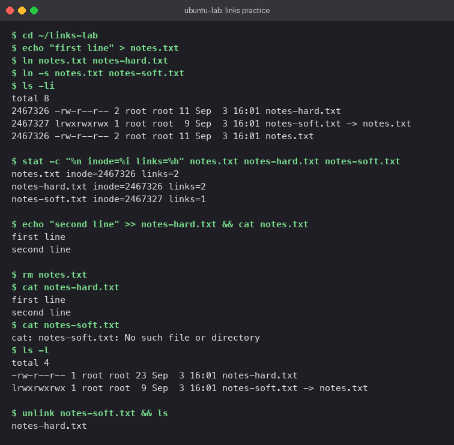

# Linux Fundamentals

Practical notes and command logs from the Linux administration lab. All commands outlined below were executed within an Ubuntu 24.04 environment (hostname `ubuntu-lab`), with verification outputs captured via screenshots.

## Part 1 — Hard Links vs Symbolic (Soft) Links

In Linux file systems, a filename acts as an entry in a directory table pointing to an **inode number**. The inode maintains file metadata and references physical data blocks on disk. Links provide multiple mechanisms for accessing target data.

- **Hard Link**: Direct secondary directory pointer to an *existing inode*. Hard links share equal status with the original filename; there is no primary vs secondary distinction. The inode's link counter increments by 1. Data remains on disk until the link count reaches 0.
- **Symbolic Link (Soft Link)**: An independent reference file holding a target path string. Symlinks possess unique inode numbers. Deleting the target file leaves a dangling link pointing to a non-existent path.

### Comparison Table

| Attribute | Hard Link | Symbolic Link |
|---|---|---|
| Target Pointer | Direct Inode reference | String path to target |
| Inode ID | Identical to source file | Unique distinct Inode |
| Target Deletion | Data persists, reachable via link | Broken link (dangling pointer) |
| Cross-Filesystem Support | Not supported | Supported |
| Directory Linking | Disabled for standard users | Supported |
| `ls -l` File Indicator | Displays as standard file | Flagged with `l` and `-> target` |

### Command Execution Sequence

```bash
ln notes.txt notes-hard.txt        # Creates a hard link
ln -s notes.txt notes-soft.txt     # Creates a symbolic link
ls -li                             # Display inode numbers (-i)
stat -c "%n inode=%i links=%h" notes.txt notes-hard.txt notes-soft.txt
rm notes.txt                       # Delete original file name
unlink notes-soft.txt              # Remove soft link entry
```

### Observation & Findings

- `notes.txt` and `notes-hard.txt` shared the exact inode (`2467326`) with a link count of 2.
- `notes-soft.txt` registered a separate inode ID with a link count of 1.
- Editing content through `notes-hard.txt` reflected immediately in `notes.txt` because both reference identical data blocks.
- Removing `notes.txt` left `notes-hard.txt` fully functional and accessible. Attempting to view `notes-soft.txt` resulted in `No such file or directory`.



---

## Part 2 — `useradd` vs `adduser`

Both tools manage user creation on Linux systems, operating at different system abstraction layers.

- `useradd`: Low-level binary utility provided by `shadow-utils`. It executes minimal setup strictly governed by supplied flags. Without `-m`, home directories are omitted; without `-s`, system default shell (`/bin/sh`) is assigned, leaving passwords uninitialized.
- `adduser`: High-level Perl wrapper script native to Debian/Ubuntu distributions. Calls `useradd` under the hood while automating home directory provisioning (`/etc/skel` copy), shell configuration (`/bin/bash`), group membership assignment, UID selection, and interactive password prompts.

**Recommendation**: Use `adduser` for interactive host user administration. Utilize `useradd` within automated bash scripts and Dockerfiles for explicit configuration control without interactive prompts.

### Command Execution Sequence

```bash
useradd -m -s /bin/bash devuser1
id devuser1
grep devuser1 /etc/passwd

adduser --disabled-password --gecos "Dev User Two" devuser2
id devuser2
grep devuser2 /etc/passwd
ls -la /home/devuser2
```

The flags `--disabled-password` and `--gecos` enable non-interactive execution for `adduser`.

### Observation & Findings

- `useradd` configured `devuser1` with basic defaults: UID 1001, primary group, and an empty home directory.
- `adduser` executed a detailed step-by-step provision: auto-allocated UID 1002, created user group, populated `/home/devuser2` with shell configuration templates (`.bashrc`, `.profile`), and set GECOS fields.
- *Note*: Standard `ubuntu:24.04` minimal images require manual installation via `apt-get install adduser`.


---

## Part 3 — `journalctl` System Log Management

`journalctl` queries the centralized binary logs maintained by `systemd-journald`. It replaces legacy plain-text log grepping with structured filtering based on unit, priority, boot session, or time window.

### Common Usage Patterns

```bash
journalctl                      # Display entire journal (paged)
journalctl -b                   # Filter entries for current boot session
journalctl -n 20                # Tail last 20 log lines
journalctl -f                   # Live stream log entries (follow mode)
journalctl -u cron              # Filter entries for specific unit
journalctl -p err               # Filter by priority level (error and above)
journalctl --since "2 minutes ago"
journalctl --since today --until "1 hour ago"
journalctl --no-pager           # Direct stdout formatting for scripting
```

### Hands-on Verification: Service Logging

Since standard containers run without systemd init by default, testing was performed inside a privileged `ubuntu:24.04` container running systemd (`/usr/lib/systemd/systemd`). Once active (`systemctl is-system-running`), `cron.service` was restarted and inspected:

```bash
systemctl restart cron
systemctl --no-pager status cron
journalctl --no-pager -b -n 12
journalctl --no-pager -u cron
journalctl --no-pager -p err -b -n 5
journalctl --no-pager --since "2 minutes ago" -n 5
```

The output confirmed `cron` service start/stop events under `-u cron`. Filtering with `-p err` produced `-- No entries --` as no errors occurred during the test window.


---

## Part 4 — Linux Command Reference Sheet

### Navigation & Discovery

| Command | Summary |
|---|---|
| `pwd` | Output working directory path |
| `ls -la` | List files including hidden dotfiles with permissions |
| `cd -` | Switch back to previous directory location |
| `tree -L 2` | Display folder hierarchy up to depth 2 |
| `find . -name "*.txt"` | Search workspace matching file patterns |
| `du -sh *` | Display disk usage of items in current directory |

### File Manipulation & Structure

| Command | Summary |
|---|---|
| `mkdir -p a/b/c` | Recursively create parent and nested directories |
| `touch file` | Create empty file or update access timestamp |
| `cp -r src dst` | Copy files or directories recursively (`-r`) |
| `mv old new` | Relocate or rename files and directories |
| `rm -rf dir` | Forceful recursive removal of directories |

### File Viewing & Content Inspection

| Command | Summary |
|---|---|
| `cat file` | Print entire file content to terminal |
| `less file` | Paginated viewer (`/` search, `q` exit) |
| `head -n 5` / `tail -n 5` | Output top or bottom line lines of file |
| `tail -f log` | Stream real-time file updates |
| `grep -rn "text" .` | Search pattern recursively showing line numbers |
| `wc -l file` | Count total lines in target file |

### Security & Access Control

| Command | Summary |
|---|---|
| `chmod 640 file` | Assign owner (rw-), group (r--), others (---) |
| `chmod +x script.sh` | Grant executable bit permission |
| `chown user:group file` | Reassign ownership rights |
| `umask` | View or configure system default file creation mask |

### User Management & Identity

| Command | Summary |
|---|---|
| `whoami` / `id` | Display current active user identity and group memberships |
| `sudo adduser name` | Provision new user account interactively |
| `passwd name` | Update password for target user account |
| `su - name` | Switch user session with environment setup |
| `groups name` | Output active group assignments for user |

### Process Monitoring & System Health

| Command | Summary |
|---|---|
| `ps aux` | Detailed process tree listing |
| `top` / `htop` | Interactive process resource usage monitor |
| `kill -15 PID` | Graceful SIGTERM process termination (`-9` for SIGKILL) |
| `df -h` | Human-readable filesystem storage usage |
| `free -h` | System RAM usage summary |
| `uname -a` | Print kernel release and system architecture |
| `uptime` | System uptime and load averages |

### Networking Utilities

| Command | Summary |
|---|---|
| `ip a` / `ip route` | Network interfaces and routing table details |
| `ss -tulpn` | Active listening network sockets and process IDs |
| `ping -c 4 host` | ICMP connectivity probe |
| `curl -I url` | Fetch HTTP response headers only |

### Package Management & System Services

| Command | Summary |
|---|---|
| `systemctl status unit` | Check runtime state of target service unit |
| `systemctl restart unit` | Restart background service unit |
| `systemctl enable --now unit` | Enable unit on boot and trigger immediate start |
| `journalctl -u unit -f` | Follow live log output for service unit |
| `apt update && apt install pkg` | Synchronize index and install packages |
| `tar -czf out.tgz dir` | Create compressed gzip archive |
| `tar -xzf out.tgz` | Extract compressed archive |
| `man cmd` / `cmd --help` | Access built-in documentation manuals |
| `history \| grep ssh` | Query historical shell command executions |

Session verification demonstrating core permission and process execution commands:


---

**Tejas Kumat** · Roll No. 24BCS10299
