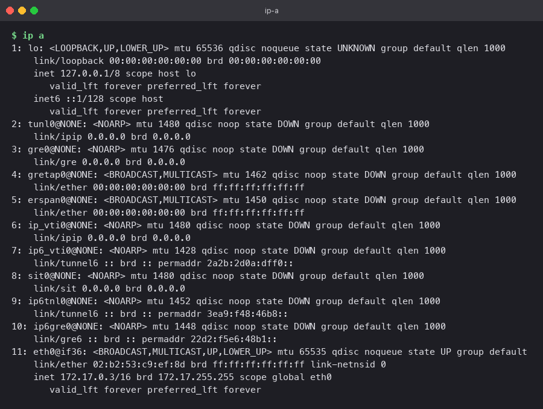
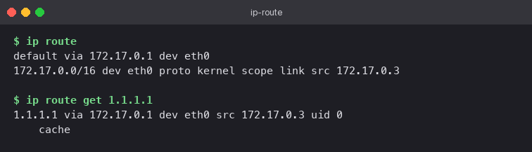
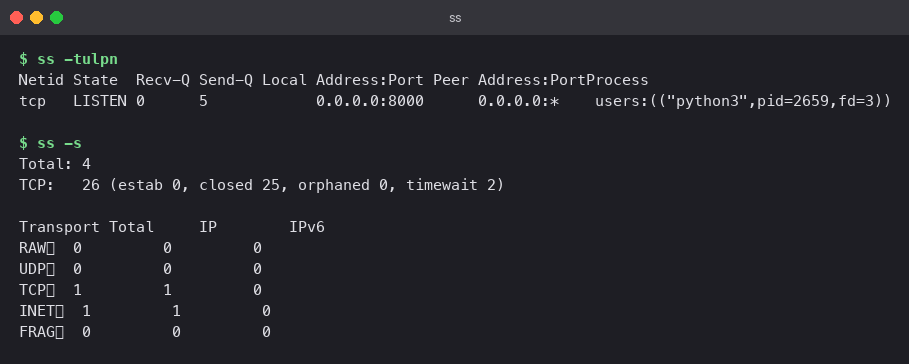
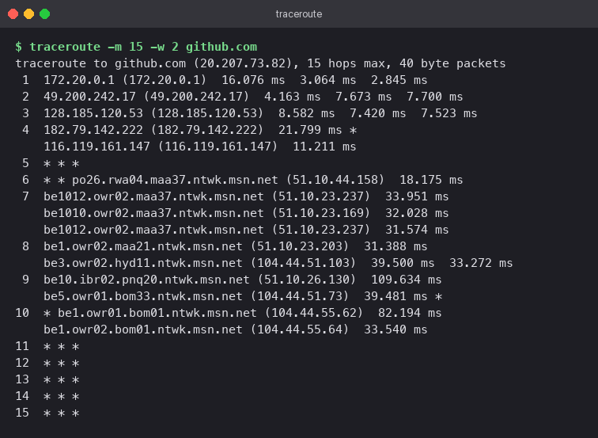

# Networking Fundamentals

Detailed breakdown of nine fundamental Linux and network diagnostic utilities. Each command was executed in active environments (macOS terminal or inside an Ubuntu 24.04 Docker container for Linux-specific utilities like `ip`, `ss`, and `wget`).

## 1. `ping` — End-to-End Connectivity & Latency Probe

```bash
ping -c 4 github.com
```

Dispatches four ICMP Echo Request packets to the target host and waits for ICMP Echo Replies. Resolves hostnames to IP addresses (`20.207.73.82`) and measures round-trip time (RTT). The summary section reports zero packet loss and minimum/average/maximum latency figures.

**Takeaway**: Provides immediate verification of basic layer-3 reachability. Note that hosts configured to drop ICMP packets will not respond, so a lack of reply does not definitively confirm a host is offline.


---

## 2. `ip a` — Interface Configuration & Addressing

```bash
ip a
```

Displays all active and inactive network interfaces, MAC addresses, and assigned IPv4/IPv6 addresses. Key interfaces inside the container include `lo` (127.0.0.1 loopback) and `eth0` (172.17.0.3/16 attached to the default Docker bridge). `ip -br a` can be used for a consolidated single-line format per interface.

**Takeaway**: Modern replacement for legacy `ifconfig`. Shows CIDR subnet masks and operational interface status (`UP`/`DOWN`).



---

## 3. `ip route` — Kernel Routing Table Inspection

```bash
ip route
ip route get 1.1.1.1
```

`ip route` outputs active kernel routing directives, highlighting the default gateway (`default via 172.17.0.1`) and subnet network routes (`172.17.0.0/16`). `ip route get` queries the exact interface and gateway path chosen by the kernel for a specific target destination.

**Takeaway**: Misconfigured or missing default routes prevent traffic from leaving local subnets.



---

## 4. `ss` — Socket Statistics & Listening Ports

```bash
python3 -m http.server 8000 &
ss -tulpn
ss -s
```

`ss -tulpn` inspects listening sockets (`-l`), TCP sockets (`-t`), UDP sockets (`-u`), numerical port designations (`-n`), and owning process names/PIDs (`-p`). `ss -s` summarizes overall socket metrics across states.

**Takeaway**: High-performance replacement for `netstat`. Essential tool for resolving port collision issues when services fail to bind.



---

## 5. `curl` — Command-Line HTTP Client

```bash
curl -I https://github.com
```

The `-I` flag sends an HTTP `HEAD` request, retrieving only response headers. The output verifies `HTTP/2 200` status, web server software, caching policies, and security headers like `strict-transport-security`.

**Takeaway**: Primary CLI tool for testing REST APIs and HTTP service behavior. Common flags: `-s` (silent mode), `-o` (save to file), `-X POST` (HTTP verb modification), `-v` (verbose TLS/header trace).


---

## 6. `wget` — File Retrieval Utility

```bash
wget https://example.com/
wget -O page.html -q https://example.com/
```

Retrieves remote resources via HTTP/HTTPS/FTP. Unlike `curl` (which outputs to stdout by default), `wget` automatically saves response payloads to local files (`index.html`). Flags: `-O` (custom destination name), `-q` (suppress progress bar).

**Takeaway**: Ideal for batch downloads and background asset mirror tasks (`-r` for recursive download, `-c` for resuming interrupted transfers).


---

## 7. `nslookup` & `dig` — Domain Name Resolution

```bash
nslookup github.com
dig +short github.com
```

`nslookup` queries DNS servers (e.g., `1.1.1.1`) returning address records (A/AAAA). `dig +short` isolates output to target IP addresses, making it optimal for automated scripts. Standard `dig` queries show detailed header flags, TTL values, and authority sections.

**Takeaway**: Critical for distinguishing network layer connectivity issues from DNS resolution failures.


---

## 8. `traceroute` — Network Hop Traversal

```bash
traceroute -m 15 -w 2 github.com
```

Traces packet transit paths by incrementing Time-To-Live (TTL) values. Each intermediate router decrements TTL, returning an ICMP Time Exceeded response. `-m 15` limits maximum hop count; `-w 2` reduces per-hop timeout wait times. Hops showing `* * *` indicate routers filtering ICMP traffic.

**Takeaway**: Identifies specific router hops introducing network latency or packet drops.



---

## 9. `hostname` — Host Identification

```bash
hostname
hostname -f
ipconfig getifaddr en0      # macOS; on Linux use: hostname -I
```

Prints system network hostname, fully qualified domain name (`-f`), and assigned interface IP address. On Linux systems, `hostname -I` lists all active non-loopback network addresses.


