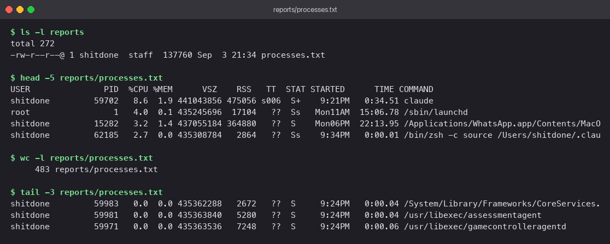

# Shell Scripting — `sysinfo.sh`

Automated Bash diagnostic script designed to collect system health metrics, prompt the user for output destination preferences, and record running process snapshots using standard I/O redirection.

## Requirement Mapping

| Task Objective | Implementation Mechanism |
|---|---|
| Display date, hostname, user identity | Command substitution `$(...)` wrapping `date`, `hostname`, `whoami` |
| Summarize storage usage | Execution of `df -h` parsed with `awk` for root filesystem metrics |
| Query running processes | `ps aux` pipeline sorted by CPU utilization (`sort -rk 3`) capped to top 10 |
| Shell variables | Declared `current_date`, `hostname_val`, `active_user`, `disk_info`, `proc_count`, `report_dir`, `report_file` |
| Interactive user input | Shell built-in prompt `read -p` |
| Directory creation | Directory provisioning with `mkdir -p "$report_dir"` |
| File creation | Target file generation using `touch "$report_dir/$report_file"` |
| Standard output redirection | Writing raw output stream using `ps aux > "$report_dir/$report_file"` |

## Script Implementation

```bash
#!/bin/bash
# sysinfo.sh - System summary generator and process list logger.
# Displays host statistics and outputs active process records to a custom directory.

current_date=$(date)
hostname_val=$(hostname)
active_user=$(whoami)
disk_info=$(df -h / | awk 'NR==2 {print $5 " used of " $2}')
proc_count=$(ps aux | wc -l | tr -d ' ')

echo "=== System summary ==="
echo "Date        : $current_date"
echo "Host        : $hostname_val"
echo "User        : $active_user"
echo "Root disk   : $disk_info"
echo "Processes   : $proc_count running"
echo

echo "--- Disk usage (df -h) ---"
df -h
echo

echo "--- Top 10 processes by CPU ---"
ps aux | sort -rk 3 | head -n 10 | cut -c1-110
echo

read -p "Directory to save the report in: " report_dir
read -p "Report file name: " report_file

mkdir -p "$report_dir"
touch "$report_dir/$report_file"

# Write detailed process list to target file using stdout redirection
ps aux > "$report_dir/$report_file"

echo
echo "Saved $(wc -l < "$report_dir/$report_file" | tr -d ' ') lines of process data to $report_dir/$report_file"
```

### Architectural Details

- Double-quoting string variables (`"$report_dir"`) prevents word splitting errors when handling paths containing whitespace.
- Using `mkdir -p` prevents shell execution failures when targeting existing directory structures.
- `sort -rk 3` sorts descending based on column 3 (%CPU). `cut -c1-110` truncates terminal display width to prevent line wrapping while storing full untruncated output in the target file.
- The `>` redirection operator truncates and overwrites destination file content on each invocation.

## Execution Procedure

```bash
chmod +x sysinfo.sh
./sysinfo.sh
```

During execution testing, `reports` was specified for destination directory and `processes.txt` for destination output file.

System diagnostic output and CPU process summary display:


Verification of output file creation and line count analysis via `ls`, `head`, and `wc -l`:



*Note*: The generated `reports/` directory represents a runtime output artifact and is excluded from version control via `.gitignore`.
---

**Tejas Kumat** · Roll No. 24BCS10299
